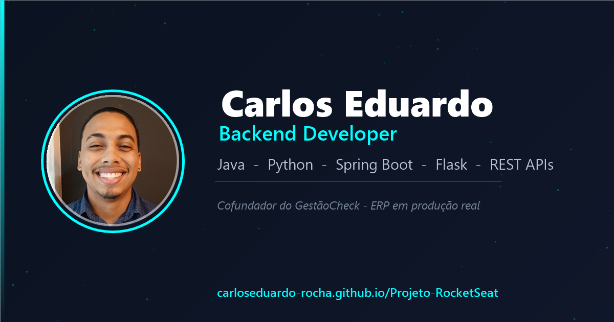

<h1 align="center">👨‍💻 Carlos Eduardo — Backend Developer</h1>

<p align="center">
  <strong>Portfólio pessoal em HTML, CSS e JavaScript puro — sem framework, sem build step.</strong><br>
  Começou no programa <em>Discover</em> da Rocketseat e cresceu para um site-vitrine com
  case study interativo, galerias, mini games e carrossel de conquistas.
</p>

<p align="center">
  <a href="#-live">Live</a>&nbsp;·&nbsp;
  <a href="#-o-que-tem-no-site">O que tem no site</a>&nbsp;·&nbsp;
  <a href="#%EF%B8%8F-stack">Stack</a>&nbsp;·&nbsp;
  <a href="#-estrutura">Estrutura</a>&nbsp;·&nbsp;
  <a href="#-rodando-localmente">Rodando localmente</a>&nbsp;·&nbsp;
  <a href="#-segurança">Segurança</a>
</p>

<p align="center">
  
  
  
  
</p>

<p align="center">
  
</p>

## 🔗 Live

**https://carloseduardo-rocha.github.io/Projeto-RocketSeat/** (GitHub Pages)

## 🧩 O que tem no site

### Perfil
- Bio curta + bolha de trajetória que abre ao passar o mouse **ou tocar** na foto
  (com um selo "Minha trajetória" pra deixar claro que tem algo ali).
- Toggle de tema **dark/light** com transição via View Transitions API e persistência
  em `localStorage`.
- Fundo de partículas em `<canvas>` que reage ao mouse e muda de cor com o tema.
- Barra de progresso de leitura no topo.

### GestãoCheck — case study
Seção dedicada (`.case-study`), não é um card comum:
- Imagem que funciona como botão: no **hover** avança um mini-carrossel com efeito de
  pilha de fotos; no **clique** abre o modal grande com a galeria completa (13 telas
  reais, claro/escuro + 1 mobile).
- Contadores animados (módulos, testes, perfis, planos), chips de features, chips de
  roadmap e uma linha do tempo de MVPs.

### Outros projetos
Grid de cards (`.project-card`). Cada card tem um **visual próprio** no topo
(diagrama de arquitetura, tabuleiro de xadrez, mockup de celular) e abre um **modal
de preview** com o visual ampliado / galeria de screenshots antes de mandar pro
GitHub. Projetos: Spring Boot Workshop, FitTribe (mobile), Chess System, AI Agent.

### Skills
Ícones (Devicon) com tooltip de nível + descrição + link do projeto. Os "dots" de
nível são gerados por JS a partir do texto do tooltip.

### Conquistas
Carrossel horizontal (`#achievements-carousel`) com drag + momentum real e destaque
no card central. Os dados ficam em `ACHIEVEMENTS` no `script.js`, separados por
categoria (formação / certificados) com um card-capa por seção. Clicar em um
certificado abre o **PDF dentro do próprio site** (modal com `<iframe>`), sem abrir
aba nova — com link de fallback caso o navegador não renderize o PDF embutido.

### Mini games
Seletor estilo Steam com 4 jogos, todos em `<canvas>`/DOM puro:
- **Snake** — motor com interpolação suave via `requestAnimationFrame`.
- **Jogo da Velha** — vs. CPU (heurística) ou 2 jogadores no mesmo aparelho.
- **Pong** — IA simples seguindo a bola.
- **2048** — grid 4×4, com swipe no mobile.

## 🛠️ Stack

| Camada | Ferramentas |
|--------|-------------|
| Marcação / estilo | HTML5 semântico, CSS puro com **custom properties** (tema dark/light) |
| Lógica | JavaScript (ES6+), Canvas API, IntersectionObserver, View Transitions API, `localStorage` |
| Fontes / ícones | Google Fonts (Inter), Devicon e Ionicons via CDN com **SRI** |
| Hospedagem | GitHub Pages (site 100% estático, **sem build step**) |

## 📁 Estrutura

```
Projeto-RocketSeat/
├── index.html            # toda a estrutura (hero, links, case study, projetos,
│                         #   skills, conquistas, mini games, footer, modais)
├── style.css             # tudo via CSS custom properties, tema dark/light
├── script.js             # tema, partículas, modal de projeto, galerias,
│                         #   hover-carousel, conquistas, visualizador de PDF,
│                         #   4 mini games, scroll reveal, tilt 3D, etc.
├── robots.txt / sitemap.xml
├── assets/
│   ├── brand/                 # avatar (claro/escuro), favicon, og-image
│   ├── backgrounds/           # bg-{desktop,mobile}[-light].jpg
│   ├── gestaocheck/           # telas reais do ERP (claro/escuro + mobile)
│   ├── fittribe/              # telas reais do app
│   ├── certificados/          # PDFs linkados nos cards de conquista
│   └── Curriculo_Carlos_Eduardo.pdf
└── CLAUDE.md             # contexto e convenções do projeto
```

## 🚀 Rodando localmente

Não tem dependência nem passo de build. Basta servir a pasta:

```bash
git clone https://github.com/carloseduardo-rocha/Projeto-RocketSeat.git
cd Projeto-RocketSeat
py -m http.server 8080
```

Depois abra `http://localhost:8080`. (Também funciona com a extensão Live Server do
VS Code — a config já está em `.claude/launch.json`.)

## 🔒 Segurança

- **CSP** restritiva via `<meta>` no `<head>` (sem config de servidor no GitHub Pages).
- **SRI** (`integrity` + `crossorigin`) nos scripts/estilos de CDN.
- Telefone e e-mail montados por JS em runtime, não em texto puro no HTML (dificulta
  scraping bobo).
- `rel="noopener noreferrer"` em todo `target="_blank"`.
- `.gitignore` protege `.claude/settings.local.json`.

## 📄 Sobre

Projeto pessoal do **Carlos Eduardo Rocha** — backend developer, cofundador e
desenvolvedor do [GestãoCheck](https://gestaocheck.tech).
Sinta-se à vontade pra se inspirar no código.

<p align="center">
  <a href="https://linkedin.com/in/carlos-eduardo-408087230">LinkedIn</a> ·
  <a href="https://github.com/carloseduardo-rocha">GitHub</a> ·
  <a href="https://www.instagram.com/cadurochhaa/">Instagram</a>
</p>
